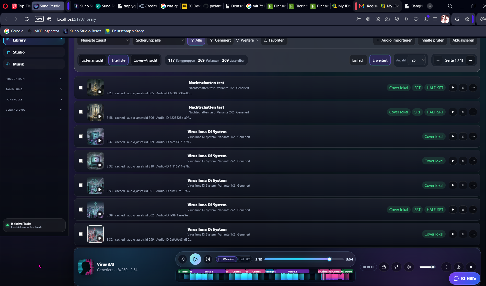

# SongStudio

Local-first music production dashboard for SunoAPI workflows.

SongStudio combines music generation, import, library management, lyrics, SRT generation, waveform navigation, cover handling and post-production tools in one React/FastAPI app. The main goal is simple: generated songs should not only exist as temporary external URLs, but be organized and preserved locally with their metadata, covers and production context.

Installation: use `INSTALLATION.md` for the maintained copy-and-paste setup guide, including WhisperX, Demucs, ffmpeg and Python requirements.

This folder contains older GitHub presentation notes and screenshot guidance. The maintained public project presentation is the root [README.md](../../README.md).

## Screenshots

### Library



Suggested additional screenshots:

| Screen | File to add | What it should show |
| --- | --- | --- |
| Music generation | `assets/screenshots/music.png` | `/music` with prompt, style, advanced Suno options and provider controls |
| Song details | `assets/screenshots/song-details.png` | metadata, lyrics, variants, waveform and action menu |
| SRT editor | `assets/screenshots/srt-editor.png` | generated subtitles, timing, cleanup and export controls |
| Cover workflow | `assets/screenshots/cover-workflow.png` | upload cover, generated cover and cover actions |
| Status page | `assets/screenshots/status.png` | task progress, logs and request/response details |

## Highlights

- SunoAPI music generation with official advanced options: `negativeTags`, `vocalGender`, `styleWeight`, `weirdnessConstraint`, `audioWeight`
- Local-first audio library with cached audio files, covers, metadata, task context and song variants
- Import existing Suno songs or Suno task IDs and store them in the local library
- Multiple library views for projects, tracks, cover grids and variant-focused browsing
- Song details with lyrics, generation options, waveform, structure segments and action menus
- Groq/OpenAI powered SRT generation with optional lyrics cleanup before transcription
- Waveform and song-section navigation for verse, chorus, bridge, intro and outro markers
- Cover workflows: upload cover, generate AI cover art, update song/library cover images
- Follow-up operations for extend, cover song, add vocals, instrumental, mashup, stems and WAV
- Playlists, favorites, bulk selection and bulk actions for production workflows
- Portable backup and restore helpers for moving local data between machines
- German/English React UI switch in the app header

## Why This Exists

Suno and similar services are useful for creating music quickly, but generated assets often depend on remote URLs and external task state. SongStudio is built around a local-first workflow:

- keep audio files available after external links expire
- keep covers and metadata available offline
- preserve generation settings and task payloads
- make song variants easier to compare
- continue production from existing local assets

## Tech Stack

- Frontend: React, Vite, plain CSS
- Backend: FastAPI, SQLAlchemy
- Database: SQLite by default, PostgreSQL-ready architecture notes exist
- Media tooling: ffmpeg/ffprobe where available
- AI/Speech providers: Groq, OpenAI and optional local/extended tooling depending on configuration
- Main external music provider: SunoAPI-compatible API

## Core Workflow

1. Create or import a song.
2. SongStudio stores the task, request payload and provider result.
3. Audio variants are materialized as local library assets.
4. Audio and cover files are cached locally when enabled.
5. The Library and Song Details pages use local database state for browsing, playback, metadata and follow-up actions.
6. Optional SRT, stems, WAV, covers and playlists can be generated from the local asset.

## Local Storage

SongStudio is designed to keep production assets local:

```text
storage/audio        cached audio files
storage/covers       cached cover images
storage/transcripts  SRT/transcript files
storage/backups      portable backup exports
```

Important settings:

```env
LOCAL_CONTENT_STORAGE_ENABLED=true
SUNO_AUDIO_CACHE_MODE=on_success
SUNO_AUDIO_STORAGE_DIR=storage/audio
SUNO_AUDIO_PUBLIC_ROUTE=/media/audio
SUNO_COVER_CACHE_ENABLED=true
SUNO_COVER_STORAGE_DIR=storage/covers
SUNO_COVER_PUBLIC_ROUTE=/media/covers
```

## Setup

```bash
python -m venv venv
source venv/bin/activate
pip install -r requirements.txt

cp .env.example .env
nano .env

npm run install:react
npm run build:react
npm run start
```

Open:

```text
React:   http://127.0.0.1:5173
FastAPI: http://127.0.0.1:8000
```

Use the root npm commands. A direct `uvicorn` start only launches FastAPI, not the complete app with the React frontend.

## Required Configuration

At minimum, configure:

```env
JWT_SECRET_KEY=change-me
SUNO_API_KEY=your-sunoapi-key
```

Optional provider keys depend on the features you enable:

```env
GROQ_API_KEY=
OPENAI_API_KEY=
REPLICATE_API_TOKEN=
```

Do not commit `.env`, local databases, generated audio, generated covers or private backups to a public repository.

## Testing

The project includes unit and regression tests for critical local-first contracts.

```bash
pytest -q
npm run build:react
```

Recommended focused checks before publishing changes:

```bash
pytest -q tests/test_music_service_generate_payload.py tests/test_schema_request_models.py tests/test_frontend_source_regressions.py
```

## Screenshot Guidelines

Before publishing the repository:

1. Create clean demo data without private lyrics, API keys, personal names or unpublished client material.
2. Capture screenshots from the React app, not from development debug pages.
3. Place images under:

```text
docs/github/assets/screenshots/
```

4. Keep file names stable so README links do not break:

```text
library.png
music.png
song-details.png
srt-editor.png
cover-workflow.png
status.png
```

## Current Status

SongStudio is an active, production-oriented personal studio tool. Some workflows depend on paid external APIs, so tests should mock provider calls whenever possible. The local-first library, metadata and file-cache behavior are core project contracts.

## License

This project is licensed under the GNU Affero General Public License v3.0. See `LICENSE`.

## Disclaimer

This project is not affiliated with Suno or SunoAPI. Use your own provider accounts and follow the terms of the services you connect.
